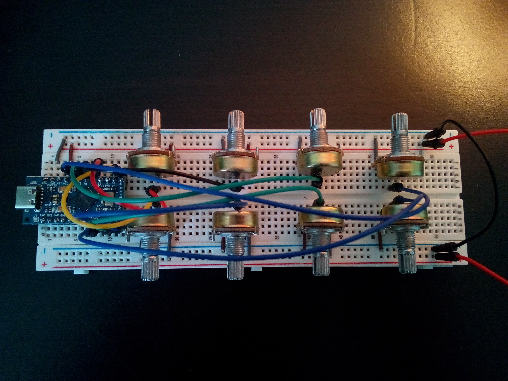
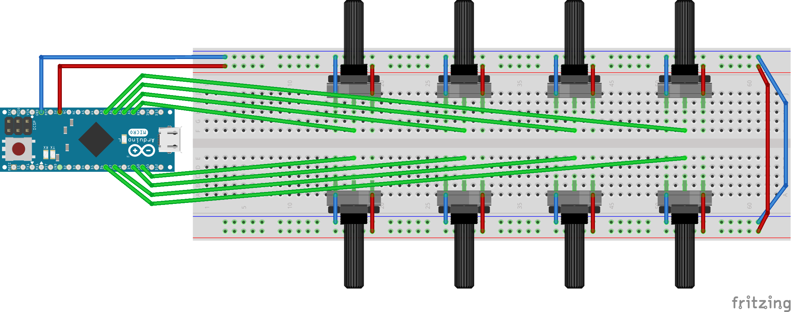
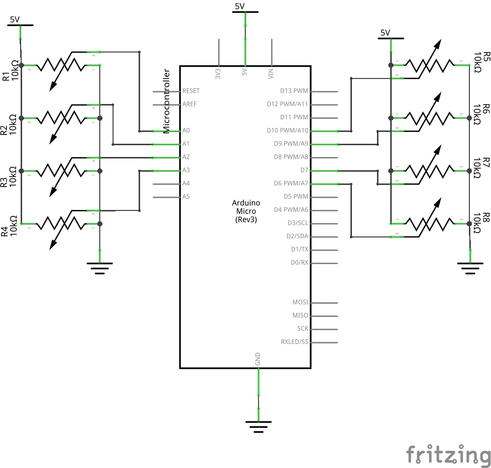

# Arduino ATmega32u4 MIDI Octopot

Arduino SysEx programmable 8 Knobs MIDI Controller inspired by [Crius Octapot Midi Controller](https://www.instructables.com/Crius-OctaPot-Midi-Controller) but using ATmega32u4 microcontroller in order to use MIDI USB.

## Photo


## Breadboard


## Schematics


## Flash Arduino ProMicro
### Arduino IDE
* Open midi-octopot/midi-octopot.ino
* Sketch menu
  * Card type: `Arduino Micro`
  * Port: `/dev/ttyACM0`
  * Upload

### Command line
```
cd midi-octopot
make
make upload
```