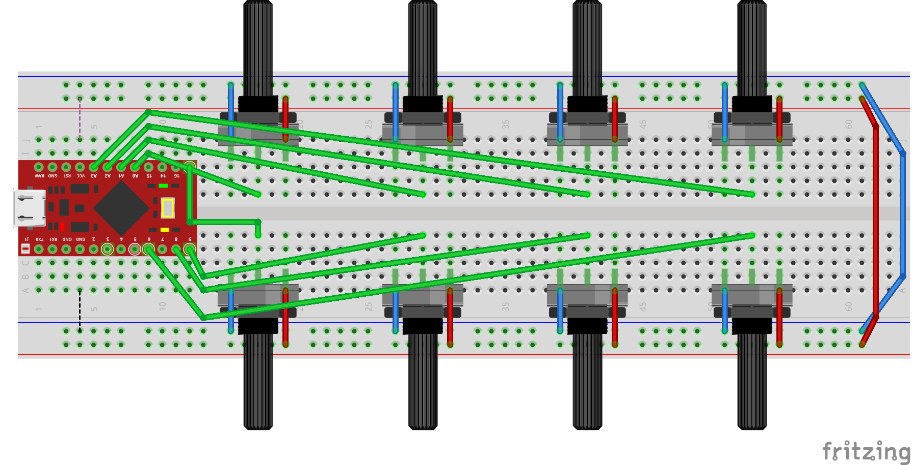
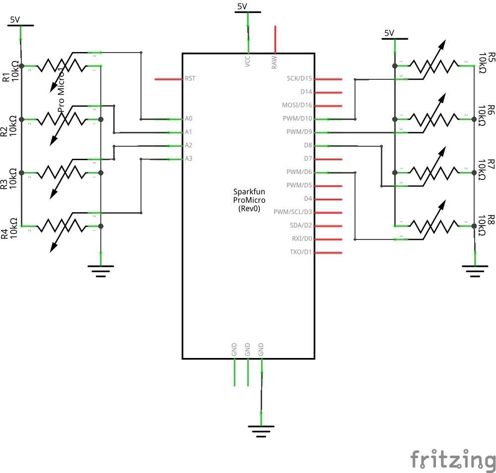

# Arduino ATmega32u4 MIDI Octopot

Arduino 8 Knobs MIDI Controller inspired by [Crius Octapot Midi Controller](https://www.instructables.com/Crius-OctaPot-Midi-Controller) but using ATmega32u4 microcontroller in order to use MIDI USB.

## Photo

## Breadboard

## Schematics
